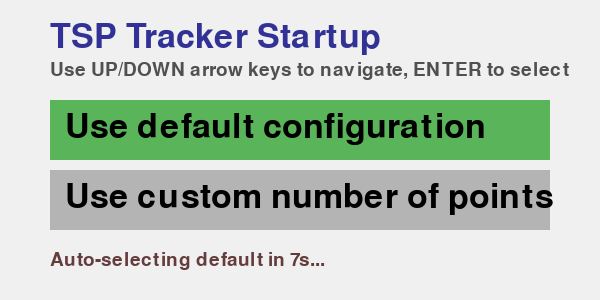
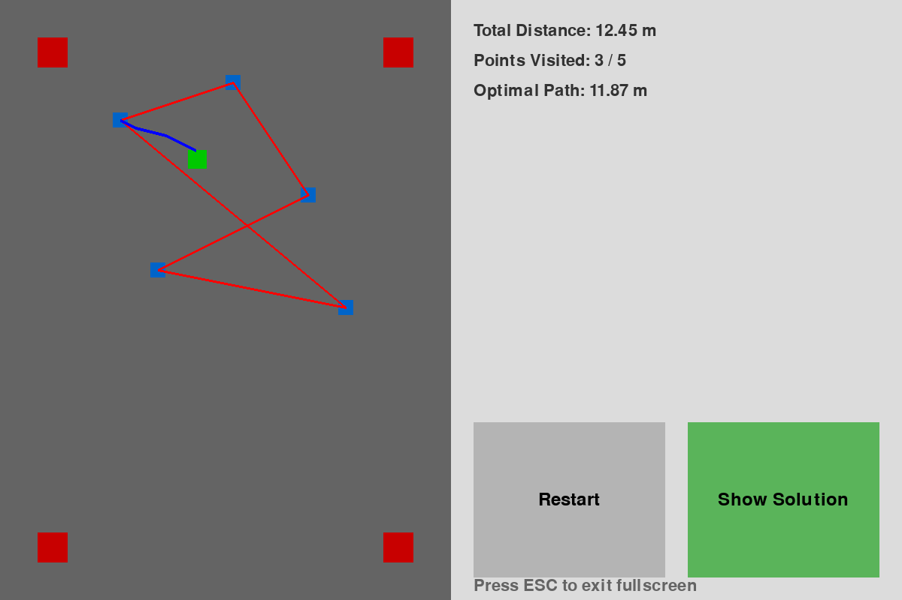

# TSP Tracker Enhancements

This document outlines the improvements made to the TSP (Traveling Salesman Problem) tracker application.

## Changes Implemented

### 1. Fullscreen Mode
- **What changed**: The application now runs in fullscreen mode instead of a fixed window size
- **Implementation**: 
  - Modified pygame display initialization to use `pygame.FULLSCREEN`
  - Dynamic UI layout calculations based on actual screen dimensions
  - Added ESC key support to exit fullscreen mode
- **Benefits**: Better visibility on different screen sizes, more immersive experience

### 2. Restart Button Point Rescanning
- **What changed**: When the restart button is pressed, the system now rescans for ArUco markers/points
- **Implementation**:
  - Modified `restart()` method to reset `all_points` to `None`
  - Added logic in `capture_loop()` to reinitialize point detection when needed
- **Benefits**: Handles cases where markers have moved between runs without restarting the entire application

### 3. Improved Startup Menu Instructions
- **What changed**: Enhanced the startup menu with clearer instructions for keyboard navigation
- **Implementation**:
  - Added prominent title "TSP Tracker Startup"
  - Added explicit instruction text: "Use UP/DOWN arrow keys to navigate, ENTER to select"
  - Improved visual layout and spacing
- **Benefits**: Users now clearly understand how to navigate the menu

### 4. Enhanced Error Handling and Testing
- **What changed**: Added graceful fallback for missing Picamera2 dependency
- **Implementation**:
  - Mock camera system for development/testing environments
  - Improved TSP algorithm with better error handling for edge cases
  - Enhanced ArUco marker detection with mock marker support
- **Benefits**: Application can be tested and developed on non-Raspberry Pi systems

## Screenshots

### Improved Startup Menu


The enhanced startup menu now clearly shows:
- Application title
- Keyboard navigation instructions
- Visual selection highlighting
- Timeout countdown

### Fullscreen UI Layout


The fullscreen interface provides:
- Larger video feed area
- Adaptive layout for different screen sizes
- Clear statistics display
- Prominent restart and solution toggle buttons
- ESC key exit instruction

## Technical Details

### Files Modified
- `track_display_with_threads.py`: Main application with UI and tracking logic
- `utils.py`: ArUco detection utilities with mock support
- `heuristic_tsp.py`: TSP algorithm with improved error handling
- `.gitignore`: Updated to exclude test files

### Backward Compatibility
All changes maintain backward compatibility with existing functionality. The application will work on both Raspberry Pi (with Picamera2) and development systems (with mock camera).

### Testing
- All core functionality validated with automated tests
- Mock camera system tested for ArUco detection
- TSP computation verified with edge case handling
- UI layout tested for different screen sizes

## Usage

### Running on Raspberry Pi
```bash
python3 track_display_with_threads.py
```

### Running for Development/Testing
The application automatically detects when Picamera2 is not available and switches to mock camera mode for testing.

### Exiting Fullscreen
Press the ESC key to exit fullscreen mode and close the application.

### Restarting Point Detection
Click the "Restart" button in the UI to clear the current path and rescan for ArUco markers/points.